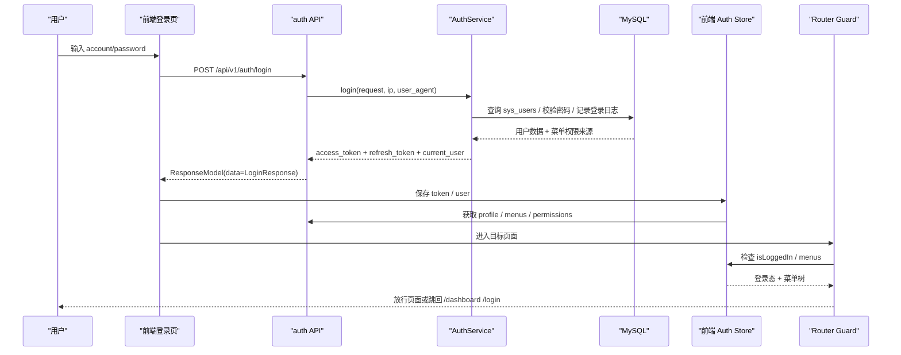
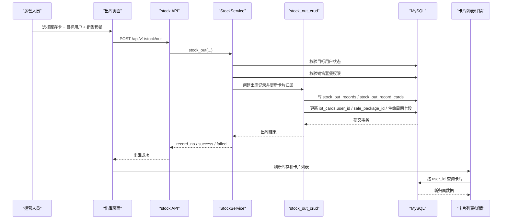
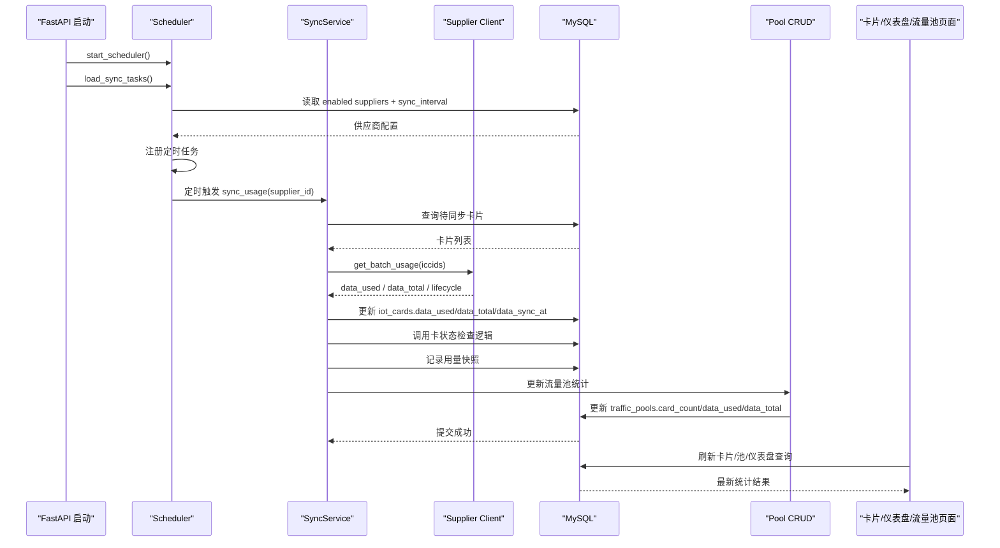
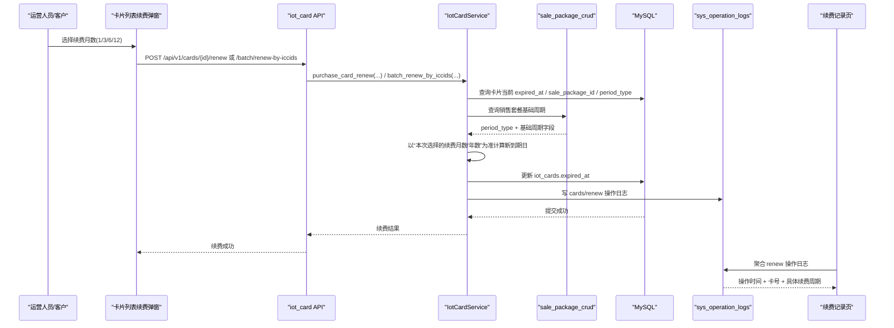
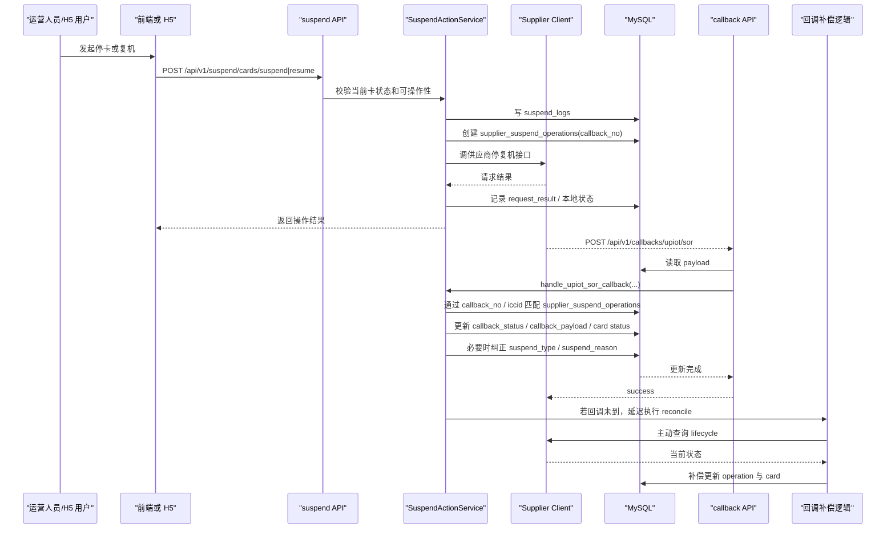

# 关键链路时序图

这份文档用于帮助维护者快速理解项目里的关键业务链路，适合用于：

- 新同学接手
- 改需求前评估影响面
- 联调时快速对齐前后端边界
- 排查“某一步成功了，但下一步没生效”的问题

建议结合以下文档一起看：

- [模块责任边界](/Users/renhui/Documents/GitHub/goodman/iot_card_platform/docs/MODULE_BOUNDARIES_GUIDE.md)
- [核心字段清单](/Users/renhui/Documents/GitHub/goodman/iot_card_platform/docs/CORE_FIELDS_GUIDE.md)
- [常见故障定位路径](/Users/renhui/Documents/GitHub/goodman/iot_card_platform/docs/TROUBLESHOOTING_GUIDE.md)

## 1. 登录与鉴权链路

适用场景：

- 登录失败
- 登录成功后立刻跳回登录页
- 页面提示无权限
- 超级登录异常

### 关键节点

- 登录入参字段以 `app/schemas/auth.py` 为准
- token 生成和登录日志记录在 `app/services/auth_service.py`
- 前端统一拦截和 401 跳转在 `frontend/src/utils/request.ts`
- 登录后菜单加载与权限校验在 `frontend/src/router/guards.ts`

### 容易出问题的点

- 登录字段名不一致
- 返回格式和前端响应拦截器不兼容
- token 保存成功，但菜单未加载
- 菜单 path 与前端 route path 不一致

## 2. 批量出库分配链路

适用场景：

- 出库成功但卡归属没变
- 出库记录有了，但卡片列表不对
- 用户看不到刚出库的卡

### 关键节点

- 出库前校验目标用户与销售套餐关系在 `app/services/stock_service.py`
- 卡片主表更新和记录表写入在 `stock_out_crud`
- 卡归属最终以 `iot_cards.user_id`、`sale_package_id` 为准

### 容易出问题的点

- 只写记录表，没有同步写卡片主表
- 目标用户被禁用
- 专属套餐误出给其他用户
- 页面刷新的是旧筛选条件

## 3. 供应商同步刷新链路

适用场景：

- 流量长期不更新
- 卡状态与供应商侧不一致
- 仪表盘数据不准
- 同步执行一次后池统计没更新

### 关键节点

- 调度器启动和任务装载在 `app/main.py`、`app/scheduler.py`
- 同步核心在 `app/services/sync_service.py`
- 供应商调用在 `app/clients/supplier_api.py`
- 池统计刷新会进一步影响告警和停卡逻辑

### 容易出问题的点

- `sync_interval` 配置异常，任务没注册
- 多实例部署，导致重复同步
- 同步成功更新卡片后，流量池统计没有刷新
- 状态被同步更新后，前端页面仍显示旧数据

## 4. 单卡 / 批量续费链路

适用场景：

- 续费成功但到期日没变
- 续费记录页没有对应记录
- 点“续费 1 个月”却被延长 3 个月

### 关键节点

- 续费接口参数语义是“续费月数”，不是“续几个出库周期”
- 到期日更新在 `app/services/iot_card_service.py`
- 续费记录页当前基于 `sys_operation_logs` 聚合
- 如果日志漏写，页面会显示“续费成功但续费记录为空”
- 当前实现默认只更新本地 `iot_cards.expired_at`，未对接供应商续费接口

### 容易出问题的点

- 错把 `iot_cards.period_count` 当成本次续费时长，导致“续费 1 个月”被放大
- 历史销售套餐 `period_months / period_days` 缺失，导致旧逻辑算不出新到期日
- 批量续费路径漏写操作日志，导致记录页查不到

## 5. 手动停复机与供应商回调链路

适用场景：

- 点击停卡/复机成功但状态没变
- 状态短暂变了又被改回去
- 回调已经收到但页面无变化

### 关键节点

- 手动停复机主逻辑在 `app/services/suspend_service.py`
- 回调入口在 `app/api/v1/callback.py`
- 回调匹配核心键是 `callback_no`
- 即使回调没到，也可能触发延迟补偿查询

### 容易出问题的点

- 本地状态更新了，但供应商侧失败
- 供应商侧成功了，但回调没落到正确记录
- 回调异常被吞掉，接口仍返回 `success`
- 同步任务或回调把手工状态再次覆盖

## 6. 模块联动总览

### 登录与鉴权链路会影响

- 登录页
- token 存储
- 菜单加载
- 路由守卫
- 超级登录

### 出库分配链路会影响

- 库存页面
- 卡片列表
- 用户归属
- 套餐关联
- 项目归属
- 出库记录

### 同步刷新链路会影响

- 卡片用量
- 卡片状态
- 流量池统计
- 仪表盘
- 停复机判断

### 停复机回调链路会影响

- 卡片状态
- 停复机日志
- 回调记录
- H5 操作结果
- 后续同步纠偏

## 7. 使用建议

当你准备修改某条链路时，建议做这三件事：

1. 先看对应时序图，确认上下游模块
2. 再对照 [核心字段清单](/Users/renhui/Documents/GitHub/goodman/iot_card_platform/docs/CORE_FIELDS_GUIDE.md) 检查关键字段
3. 最后按 [常见故障定位路径](/Users/renhui/Documents/GitHub/goodman/iot_card_platform/docs/TROUBLESHOOTING_GUIDE.md) 设计回归验证点
